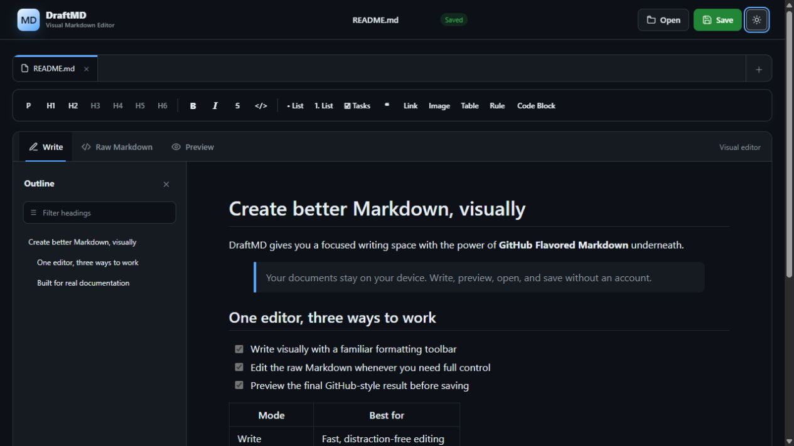
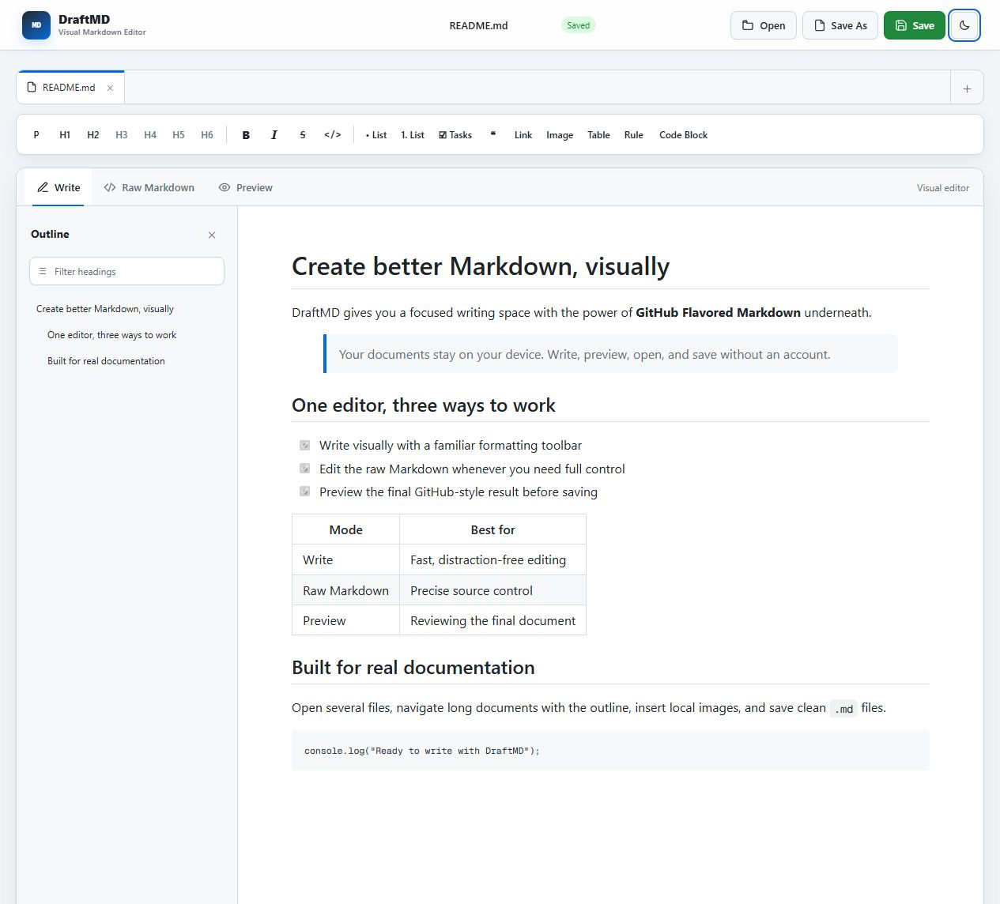

<div align="center">

# DraftMD

### A fast, private, visual Markdown editor for the browser

Write visually, edit the raw Markdown, preview the result, and save clean `.md` files without sending your documents to a server.

[](https://github.com/3badiii/DraftMD/releases)
[](LICENSE)
[](https://www.typescriptlang.org/)
[](https://react.dev/)
[](https://github.github.com/gfm/)

**Visual editing · Raw Markdown · Live preview · Multiple files · Local-first privacy**

</div>

---

## Preview



<details>
<summary><strong>View the light theme</strong></summary>



</details>

## About DraftMD

DraftMD is a browser-based visual Markdown editor built for README files, notes, documentation, command references, and technical writing. It combines a familiar rich-text writing surface with direct access to GitHub Flavored Markdown (GFM).

Documents are processed locally in the browser. DraftMD has no account system, server-side database, analytics service, or document-upload backend.

## Why DraftMD?

| Capability | What it provides |
| --- | --- |
| Visual editor | Format content without memorizing Markdown syntax |
| Raw Markdown | Inspect and edit the exact `.md` source at any time |
| Rendered preview | Review GitHub-style output before saving |
| Multi-document tabs | Open and switch between several files in one session |
| Local-first processing | Keep document content on the device |
| Lightweight setup | Start the editor with one script and no server-side database |

## Features

- Visual formatting for paragraphs, H1-H6, bold, italic, strikethrough, and inline code
- Bullet lists, numbered lists, task lists, quotes, tables, rules, and fenced code blocks
- GitHub Flavored Markdown parsing and rendering
- Synchronized Write, Raw Markdown, and Preview modes
- Multiple open documents with independent names and save states
- Drag-and-drop file tabs with persistent custom ordering
- Automatic local session recovery after a refresh or browser restart
- Searchable document outline with heading navigation
- Open one or several `.md`, `.markdown`, or text files
- Save supported files back to their original location or use Save As for a new copy
- Insert links without unsupported browser prompts
- Insert remote or local images with optional width and height
- Dark-first GitHub-inspired themes with a saved light or dark preference
- Responsive layouts for mobile, laptop, and large displays
- Deferred preview and outline rendering for smoother typing
- Sanitized rendered HTML for safer previews

## Quick start

### Requirements

- Node.js 22.13 or newer
- npm, included with Node.js
- A current browser such as Chrome, Edge, Firefox, or Safari

### Windows

1. [Download the repository as a ZIP](https://github.com/3badiii/DraftMD/archive/refs/heads/main.zip).
2. Extract the ZIP.
3. Double-click `start-windows.bat`.

If Node.js is missing, the script offers to install the current Node.js LTS release through Windows Package Manager. DraftMD then installs missing project dependencies, starts the local server, waits until it is ready, and opens the default browser automatically.

### macOS or Linux

Open a terminal in the extracted project folder and run:

```bash
bash start-unix.sh
```

DraftMD starts and opens automatically in the default browser.

## Manual installation

```bash
npm install
npm run dev
```

Open `http://localhost:3000` if the browser is not already open.

## Using the editor

### Create and open documents

- Select `+` in the file tab bar to create a new document.
- Select `Open` to choose one or several Markdown files.
- Switch between documents using the tabs.
- Drag a file tab onto another tab to change its position. The custom order is restored with the local session.
- An amber dot identifies unsaved changes.

### Write and format

Use `Write` for visual editing. Select text and use the toolbar to apply formatting. Markdown pasted into the visual editor is converted into formatted content automatically.

Use `Raw Markdown` to edit the source directly. Use `Preview` to inspect the rendered result.

### Insert images

Select `Image`, then enter an image URL or choose an image from the device. Optional width and height values accept 1 to 4000 pixels. Leave either value empty to preserve the automatic dimension.

Local images are embedded as Data URLs so the saved Markdown document remains self-contained. The maximum local image size is 5 MB.

> [!NOTE]
> Some third-party Markdown platforms, including repository viewers, may restrict Data URL images. Repository-relative image files are more suitable for public GitHub documentation.

### Save a document

In Edge, Chrome, and other supported Chromium browsers, select `Open` to grant DraftMD access to a Markdown file. After editing, select `Save` to write changes back to that original file. The browser asks for write permission before the first update.

Select `Save As` to choose a different name or location. Browsers without the File System Access API fall back to downloading a new `.md` file instead of overwriting the original.

DraftMD restores open documents and unsaved changes from local browser storage after a refresh. A browser may ask for file permission again before updating an original file in a restored session.

## Supported Markdown

| Content | Supported |
| --- | :---: |
| Headings H1-H6 | Yes |
| Bold, italic, and strikethrough | Yes |
| Inline and fenced code | Yes |
| Links and images | Yes |
| Bullet and numbered lists | Yes |
| Task lists | Yes |
| Blockquotes | Yes |
| Tables | Yes |
| Horizontal rules | Yes |
| Raw HTML sanitization | Yes |

## Technology

- TypeScript
- React 19
- Vinext and Vite
- Marked
- Turndown with the GFM plugin
- DOMPurify
- Cloudflare-compatible production worker

## Available commands

| Command | Purpose |
| --- | --- |
| `npm run dev` | Start the development server |
| `npm run build` | Create a production build |
| `npm run start` | Run the production build locally |
| `npm run lint` | Check code quality and accessibility |
| `npm test` | Build DraftMD and run automated tests |
| `npm run check` | Run linting, the production build, and all tests |

## Production build

```bash
npm install
npm run build
npm run start
```

## Docker and Synology NAS

DraftMD includes a multi-stage Docker image that runs the Vinext standalone production server as a non-root user. No database or persistent Docker volume is required because documents and recovery sessions remain in each user's browser.

### Run with Docker Compose

```bash
docker compose up --build -d
```

Open `http://localhost:3000`. Stop the service with:

```bash
docker compose down
```

### Deploy with Synology Container Manager

1. Install `Container Manager` from Synology Package Center.
2. In File Station, create a folder such as `/volume1/docker/draftmd`.
3. Upload the complete repository into that folder. Do not upload `node_modules`, `dist`, `.next`, `.vinext`, or `.wrangler`.
4. Open `Container Manager`, select `Project`, and then select `Create`.
5. Enter `draftmd` as the project name and select the uploaded folder as the project path.
6. Use the existing `docker-compose.yml` file as the project source.
7. Build and start the project, then open `http://NAS_IP:3000`.

For direct write-back to opened files, access DraftMD through HTTPS. Browsers may limit the File System Access API on an insecure LAN address and fall back to file upload and download. Synology Web Station or Login Portal can expose the container through an HTTPS reverse proxy after the container is running.

## Project structure

```text
draftmd/
|-- app/
|   |-- globals.css       # Responsive GitHub-inspired interface
|   |-- layout.tsx        # Metadata and application shell
|   `-- page.tsx          # Editor, tabs, outline, preview, and file actions
|-- public/
|   `-- screenshots/      # Images used by this README
|-- scripts/
|   `-- open-browser.mjs  # Cross-platform automatic browser launcher
|-- tests/                # Automated release checks
|-- worker/               # Production worker entry point
|-- .dockerignore         # Files excluded from the Docker build context
|-- Dockerfile            # Multi-stage standalone production image
|-- docker-compose.yml    # Local and Synology container configuration
|-- start-unix.sh         # Quick start for macOS and Linux
|-- start-windows.bat     # Quick start for Windows
|-- package.json
`-- README.md
```

## Privacy and security

- Document text, selected images, and session recovery data remain in local browser storage unless the user explicitly saves or shares them.
- Rendered HTML is sanitized with DOMPurify.
- Script, style, iframe, object, and embed elements are blocked from rendered documents.
- Inline color attributes are removed to preserve readability in both themes.
- DraftMD does not require an account, API key, server-side database, or analytics connection.

## Performance

Preview and outline updates are deferred so typing remains responsive. Large images embedded as Data URLs still increase document size and memory use. Hosted URLs or repository image files are more efficient for large documentation projects.

## Roadmap

- [ ] Side-by-side editor and preview
- [ ] Keyboard shortcuts
- [ ] Find and replace
- [ ] Drag-and-drop files and images
- [ ] Export Markdown and related images as a ZIP
- [ ] HTML and PDF export

## Contributing

1. Fork the repository.
2. Create a focused feature branch.
3. Make and test the change.
4. Run `npm run check`.
5. Open a pull request with a clear description and screenshots when the interface changes.

## Author

Created and maintained by [3badiii](https://github.com/3badiii).

Copyright © 2026 3badiii.

## License

DraftMD is available under the [MIT License](LICENSE).
